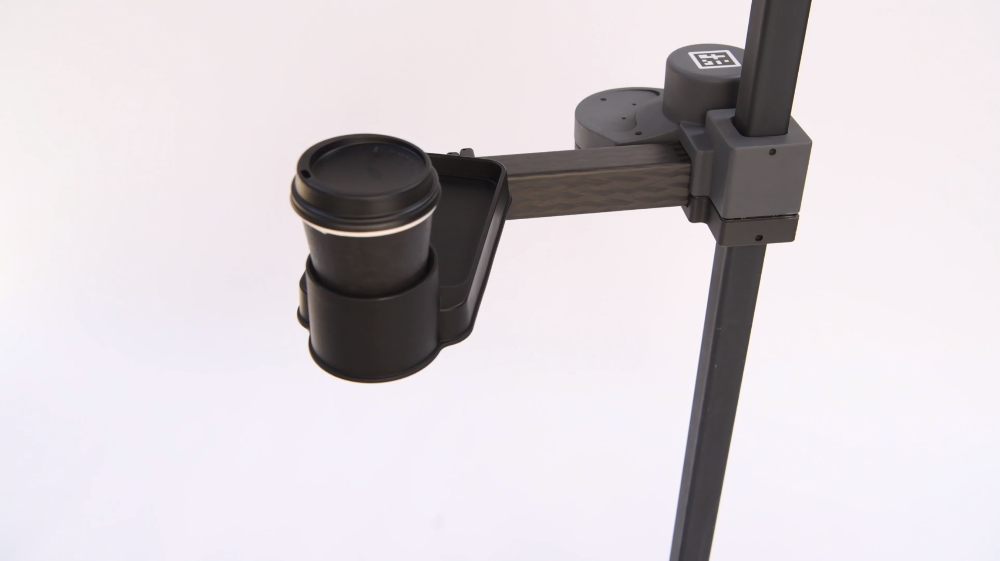

## Overview

We designed Stretch to be easily extensible. You can make your own tool and attach it to the wrist to creatively expand what the Stretch RE1 can do. Your tool can also use Dynamixel X-series servos from Robotis via the provided TTL bus. 

In this repository, we provide examples of tools that we've created. We've released them with a permissive Apache 2.0 license, so you're free to use them as you wish. We hope they'll inspire you to create your own tools.

We'd love it if you shared your creations with the community. We recommend you create a GitHub repository similar to this one for your own tools and then post an announcement to the [forum](https://forum.hello-robot.com/) to let people know about it. 

|                    Tool                     |                                                              |
| :-----------------------------------------: | :----------------------------------------------------------: |
|     [Phone Holder V1](/phone_holder_V1)     |  |
|   [ReactorX Wrist V1](/reactorx_wrist_V1)   |  |
| [Dry Erase Holder V1](/dry_erase_holder_V1) |  |
|    [Swiffer Mount V1](/swiffer_mount_V1)    |  |
|  [Tray Cup Holder V1](/tray_cup_holder_V1)  |  |
|           [Puller V1](/puller_v1)           |  |
|     [Stretch RE1 Arm](/stretch_RE1_arm)     |  |

## Licenses

The contents in this repository that represent parts of the Stretch RE1 robot, such as its arm, wrist, and default gripper, are covered by the [CC BY-NC-SA 4.0](https://creativecommons.org/licenses/by-nc-sa/4.0/) license. Please note that the Stretch RE1 robot and its default gripper are also covered by pending patents. Please see the ROBOT_LICENSE.md file for details. 

Other contents in this repository created by Hello Robot Inc. that specifically pertain to the tools that attach to the Stretch RE1 as accessories are covered by the [Apache 2.0](http://www.apache.org/licenses/LICENSE-2.0) license. Please see the TOOL_LICENSE.md file for details. 

The contents of this repository are intended for use with the Stretch RE1 mobile manipulator, which is a robot produced and sold by Hello Robot Inc. For further information, including inquiries about dual licensing, please contact Hello Robot Inc.
