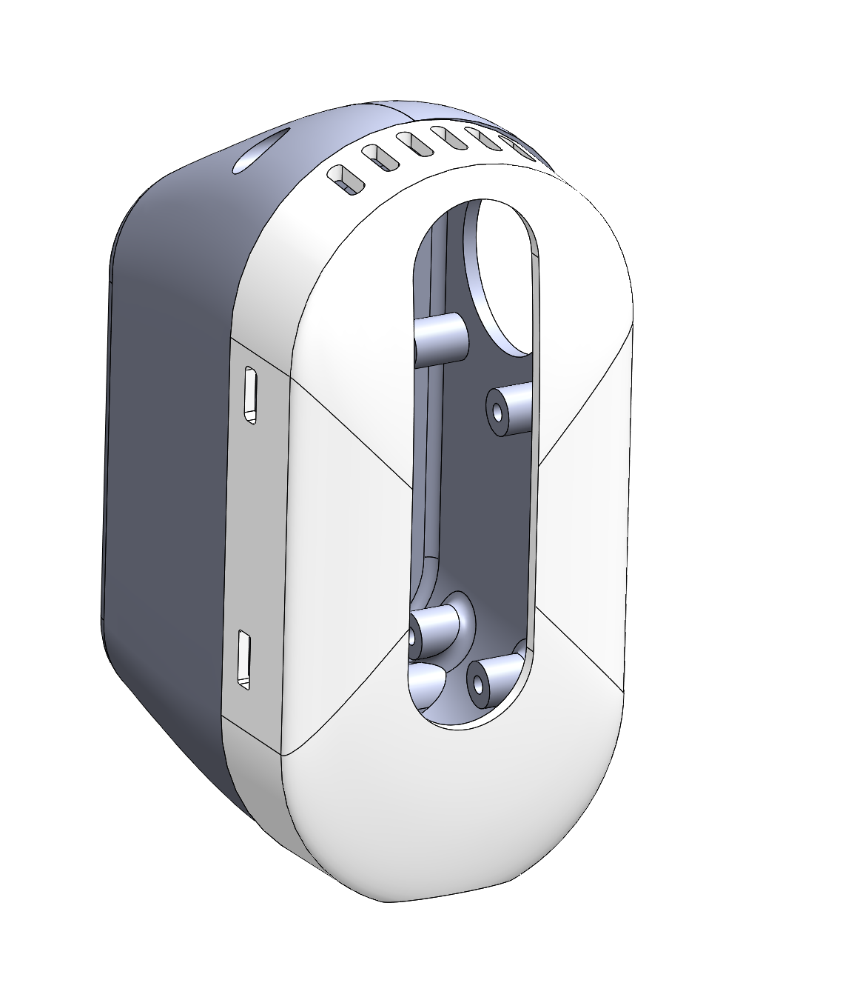
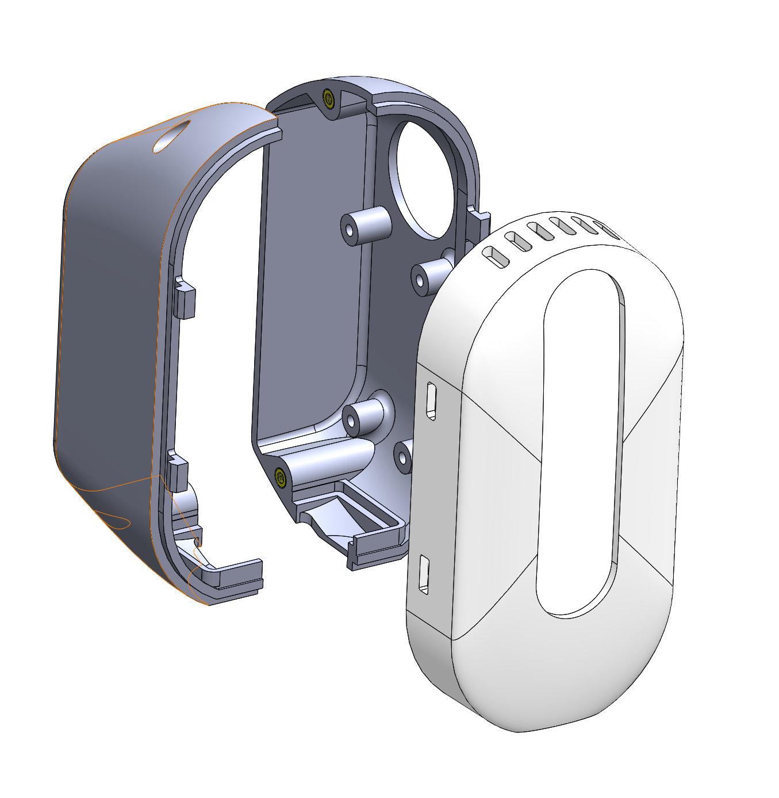

## Stretch RE1 Arm Model

**Created by**: Hello Robot Inc

These are STL models of the Stretch RE1 head shells. They can assist the design of your own tools to attach to Stretch's head. These shells can be printed in PLA using an FDM printer. The heat set inserts use McMaster Carr part number 94180A321.

| Files                                                        |
| ------------------------------------------------------------ |
| [Stretch_RE1_Head_Left.STL](CAD/Stretch_RE1_Head_Left.STL)   |
| [Stretch_RE1_Head_Right.STL](CAD/Stretch_RE1_Head_Right.STL) |
| [Stretch_RE1_Head_Camera.STL](CAD/Stretch_RE1_Head_Camera.STL) |
