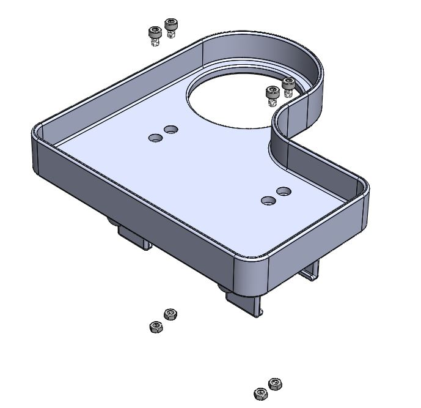

# Arm-Mounted Tray

**Created by**: Hello Robot Inc

## Overview

This tray conveniently clips onto Stretch's first arm link to provide a surface for carrying objects, including two hooks in the front and a cup holder to assist a variety of tasks. 

## Parts List

| Item | Qty | Vendor           |
| ------------- |:-------------:| -----: |
| [Tray](CAD/stretch_tray.STL) | 1 | PLA 3D Printer |
| [Arm Clips](CAD/tray_clip.STL) | 2 | PLA 3D Printer |
| [M4x6mm Socket Head Screw](https://www.mcmaster.com/91292A107/) | 4 | McMaster-Carr |
| [M4 Nut](https://www.mcmaster.com/91828A231/)       | 4 | McMaster-Carr |

## Assembly instructions
[View 3D assembly](CAD/stretch_arm_tray_asm.STL)

1. Install one M4 screw through each tray hole, and secure each with an M4 nut set in the tray clips. Ensure the hooks on the tray clips are facing the flat side of the tray, away from the cupholder.
2. Press the tray onto the first arm link until it snaps into place. 

