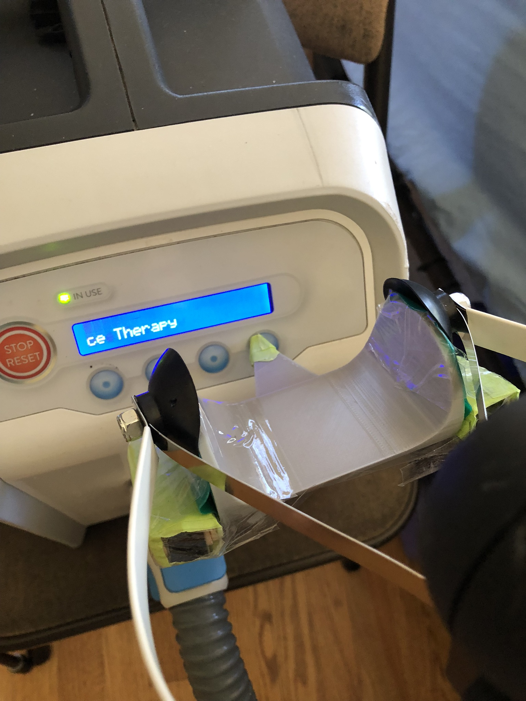

## Button Pusher

**Create by**: Hello Robot Inc. and Henry Evans

A simple part to help Stretch push buttons or anything else you can imagine. The concave shape is designed to avoid blocking the gripper teleop camera, allowing for high-percision and easy use.  

We found adding a layer of Dycem non-slip material helped with a more secure grip on the tool. Foam or cardboard blocks under each gripper pad may help stabilize as well. 

## Parts List

| Item | Qty | Vendor           |
| ------------- |:-------------:| -----: |
| [button_pusher_V2.stl](CAD/button_pusher_V2.stl) | 1 |    PLA 3D printer|
| [Dycem](https://www.dycem-ns.com/dycemshop/product/non-slip-reel/) | 1 |    Various|