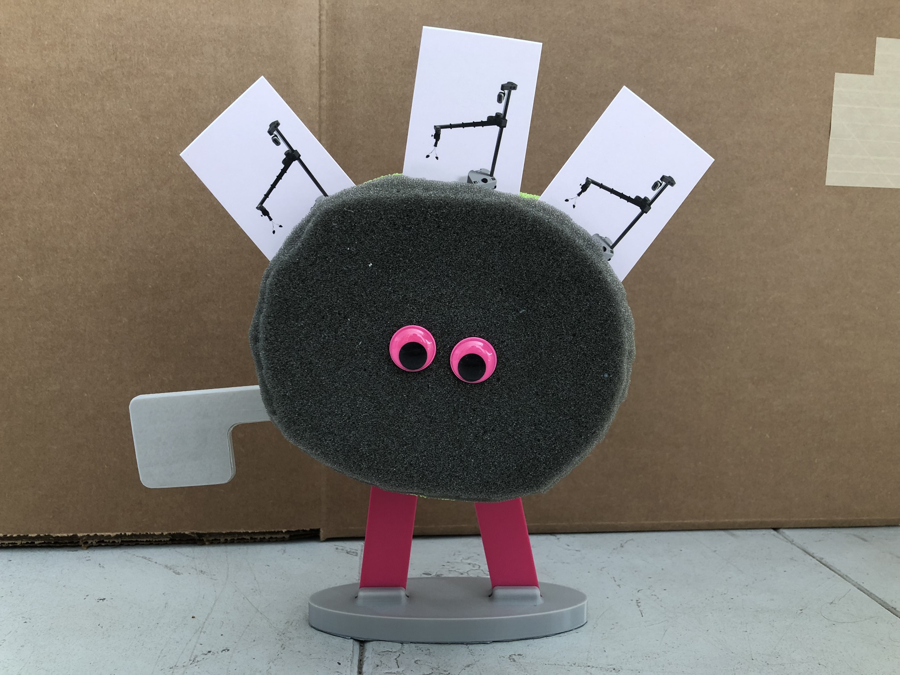
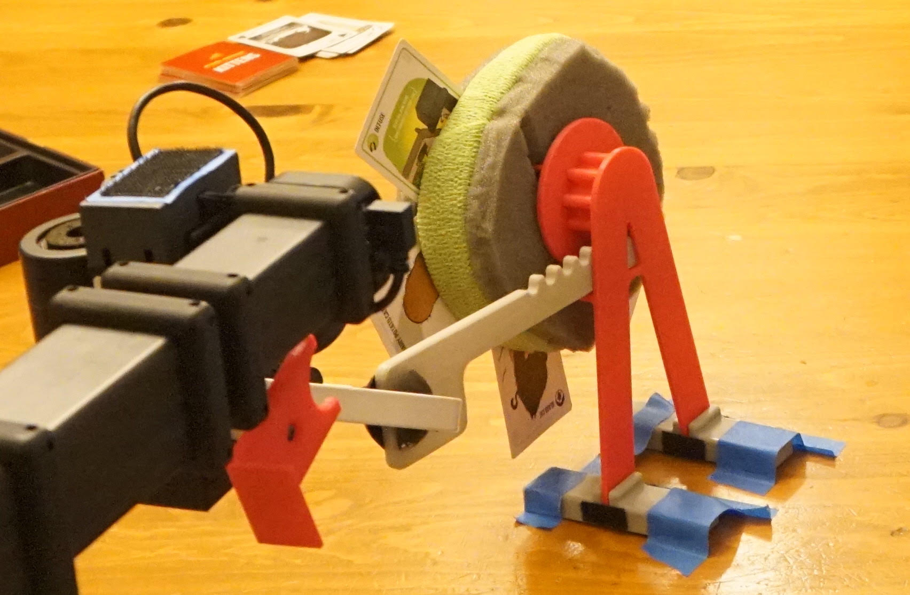
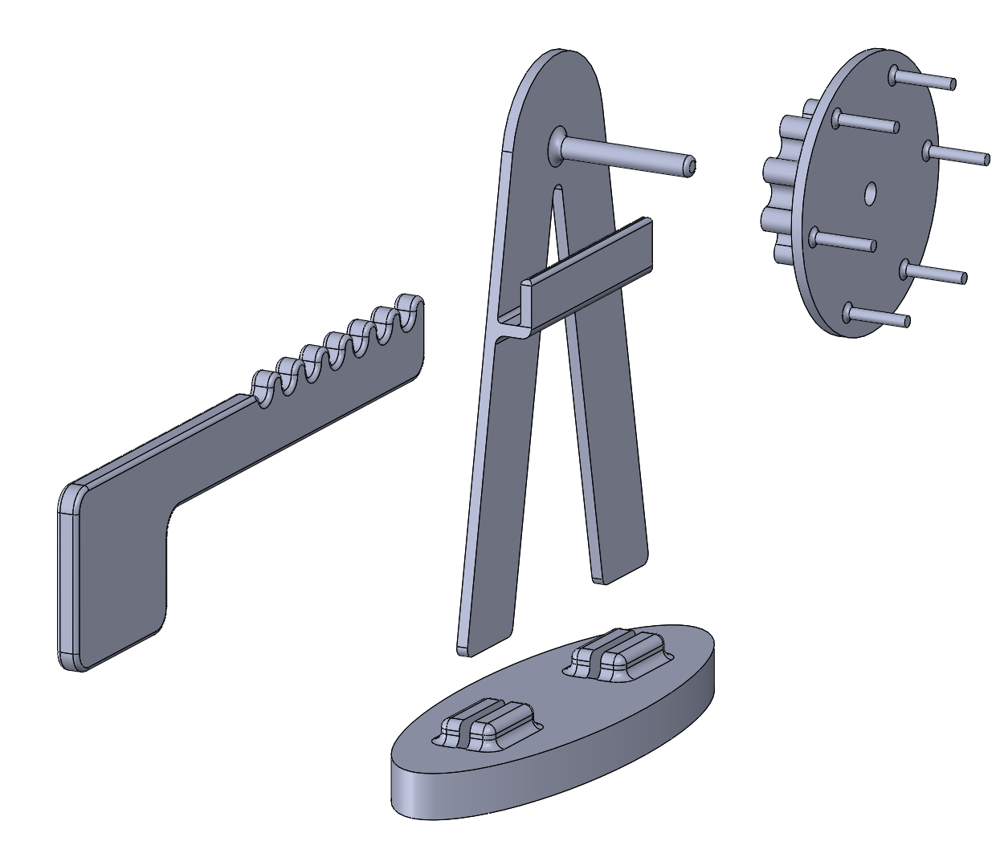

## Easy-Access Playing Card Holder

**Created by**: Hello Robot Inc

A spinning card holder that Stretch can manipulate to position cards in an optimal position for grasping or to signal which card an opponent should take. 

## Parts List

| Item | Qty | Vendor           |
| ------------- |:-------------:| -----: |
| [Gear Wheel](CAD/gear_wheel.STL) | 1 | PLA 3D printer |
| [A Frame](CAD/A_frame.STL) | 1 | PLA 3D printer |
| [Base](CAD/base_v2.STL) | 1 | PLA 3D printer |
| [Pull Tab](CAD/pull_tab.STL) | 1 | PLA 3D printer |
| Foam Block* | 1 | Recycled Material |

*We used extra packing foam, but styrofoam or anything similar should work!

## Assembly instructions

1. Cut an approximately 6 inch diameter circle out of the foam. Slice around the perimiter about 2 inches into the foam to create a slot to hold cards.  
2. Gently press the spikes on the front of the gear wheel into the center of the foam circle. Push the axel on the A frame through the hole in the back of the wheel gear and into the foam until the back of the wheel gear meets the front of the A frame. 

3. With the foam and gear wheel secured onto the A frame, push the frame into the openings on the base.

4. Slide the pull tab into the slot on the A Frame. The teeth on the pull tab should interlock with the teeth on the wheel gear so pulling and pushing the tab spins the wheel.