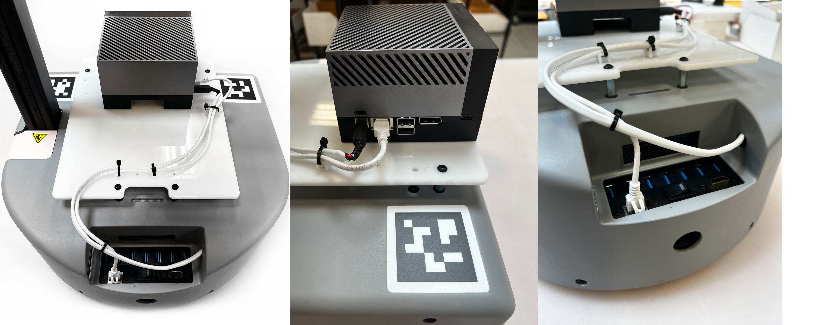
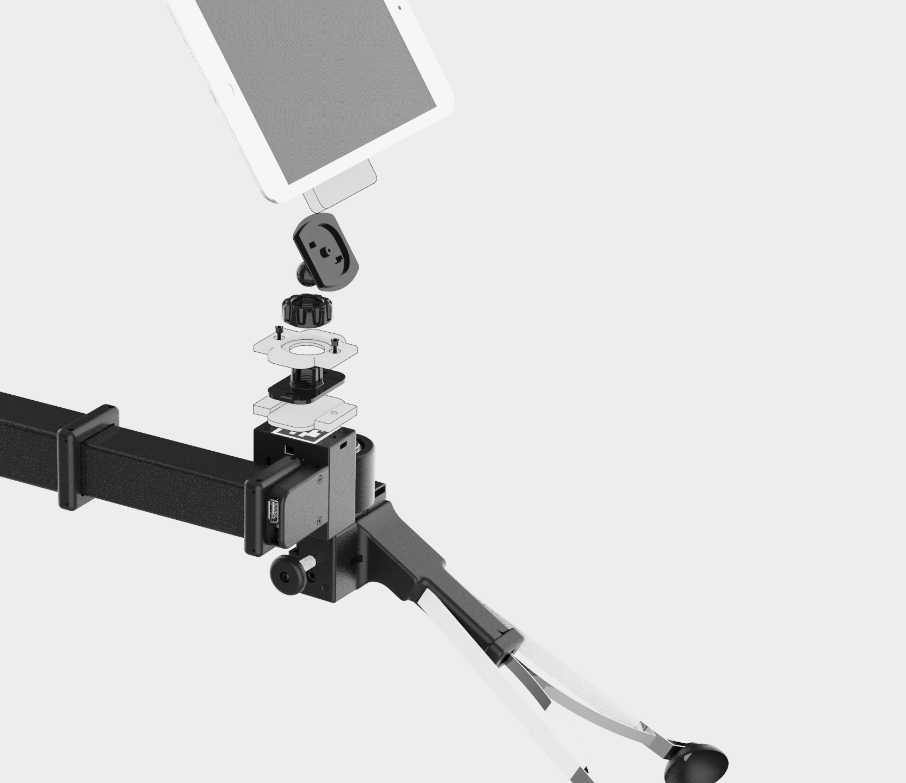

## Nvidia Jetson Orin AGX base mount

**Created by**: Hello Robot Inc

This tool allows a Nvidia Jetson Orin AGX to be attached to the Stretch base. The design uses a laser cut piece of Acrylic ordered from Ponoko.com, an off the shelf ethernet cable and a 12volt 16AWG 2.5mm male DC power cable ordered from Amazon.

## Parts List

| Item                                                                                                                                         | Qty | Vendor           |
|----------------------------------------------------------------------------------------------------------------------------------------------|:-------------:| -----: |
| [M3x10mm SHCS](https://www.mcmaster.com/91290A115/)                                                     | 2 | McMaster-Carr|
| [Double stick mounting tape 2 3/8"](https://www.amazon.com/gp/product/B09VRXDMWW/ref=ppx_yo_dt_b_search_asin_title?ie=UTF8&psc=1) | 1 | Amazon |
| [swivel_adapter_top.STL](CAD/swivel_adapter_top.STL)                                                    | 1 | PLA 3D printer |
| [swivel_adapter_bottom.STL](CAD/swivel_adapter_bottom.STL)                                              | 1 | PLA 3D printer |                          
| [tablet_tape_adapter.STL](CAD/tablet_tape_adapter.STL)                                                  | 1 | PLA 3D printer |
| [Magnetic car phone holder](https://www.amazon.com/gp/product/B075XZBKBQ/ref=ppx_yo_dt_b_search_asin_title?ie=UTF8&th=1) | 1 | Amazon |

## Assembly instructions
[View 3D Assembly](CAD/ASSEM_ball_swivel.STEP)

1. 
2. 
3. 
4. 
5. 
6. 
7. 
