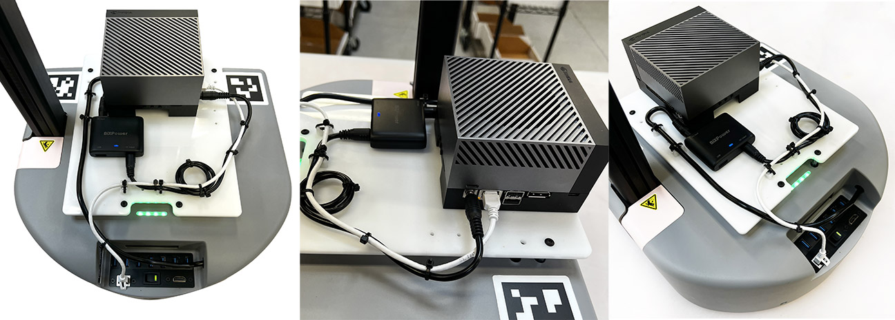

## Nvidia Jetson Orin AGX Backpack

**Created by**: Hello Robot Inc

This tool allows an Nvidia Jetson Orin AGX to be mounted and wired to the Stretch base. The design uses a laser cut piece of white Delrin ordered from Ponoko.com, and a number of off the shelf items listed below.




## Parts List

| Item                                                                                                                                                                                                         | Qty |        Vendor |
|--------------------------------------------------------------------------------------------------------------------------------------------------------------------------------------------------------------|:-------------:|--------------:|
| [DC Power Pigtails Cable, DC 5.5mm x 2.5mm Male Plug Jack to Bare Wire Open End Power Supply Replacement 3Ft](https://www.amazon.com/gp/product/B09JKNRHBZ/ref=ppx_yo_dt_b_asin_title_o03_s00?ie=UTF8&psc=1) | 1 |        Amazon |
| [12V DC to 19V DC Mini Size Ultra-slim High Efficiency 90W Power Adaptor DD90M-19V](https://www.bixpower.com/BX-DD90M-p/bx-dd90m-19v.htm)                                                                    | 1 |           BIX |
| [JST VH 3.96 mm Pitch 2 Pin](https://www.amazon.com/pzsmocn-JST-VH-VH-SMT-Terminal-Connector/dp/B089QRPTYS?th=1)                                                                                             | 1 |        Amazon |
| [CAT6A Slim Cable UTP Booted 1.5 FT](https://www.amazon.com/gp/product/B07WZQCBBF/ref=ppx_yo_dt_b_asin_title_o05_s00?ie=UTF8&psc=1)                                                                          | 1 |        Amazon |
| [White Delrin Laser Cut Base](https://www.ponoko.com/materials/white-delrin) using [Jetson_Orin_AGX_base_plate_flat_pattern.DXF](CAD/Jetson_Orin_AGX_base_plate_flat_pattern.DXF)                                                                                                                             | 1 |        Ponoko |
| [Male-Female Threaded Hex Standoff](https://www.mcmaster.com/93655A308/)                                                                                                                                     | 4 | McMaster-Carr |
| [Cable Tie Mount](https://www.mcmaster.com/7566K12/)                                                                                                                                                         | 5 | McMaster-Carr |
| [Cable Zip Ties 4 Inch](https://www.amazon.com/gp/product/B07V6QLSBP/ref=ppx_yo_dt_b_search_asin_title?ie=UTF8&psc=1)                                                                                        | 8 |        Amazon |
| [Phillips Rounded Head Thread-Forming Screws](https://www.mcmaster.com/90380A375/)                                                                                                                           | 5 | McMaster-Carr |
| [Black-Oxide Alloy Steel Button Head Torx Screws](https://www.mcmaster.com/96452A714/)                                                                                                                       | 4 | McMaster-Carr |
| [Torx Flat Head Thread-Cutting Screws for Metal](https://www.mcmaster.com/90390A112/)                                                                                                                        | 4 | McMaster-Carr |


## Assembly instructions                                                                                               
 [NVIDIA Jetson Orin AGX Mount Assembly Instructions PDF](images/Stretch_2_NVIDIA_Jetson_Orin_AGX_Mount_Installation.pdf)                                                                                  
1. Cut the DC power cable 20" in length. Pigtail the cable and expose 3/16" of copper wire . Crimp with JST-VH crimper tool and attach the JST-VH 2 pin connector.

2. Remove base shell from Stretch base.

3. Connect the 2 pin connector to 12volt Aux on PIMU.

4. Route cable through Aux hole in the base shell and re-install base shell.

5. Mount the Jetson Orin AGX to white delrin custom plate using 4x Torx Flat Head Thread-Cutting Screws for Metal.

6. Add 4x Male-Female Threaded Hex Standoff to Stretch Base accessory mounts.

7. Mount the white delrin custom plate to standoffs using 4x Steel Button Head Torx Screws.

8. Plug in ethernet cable to Jetson Orin AGX.

9. Plug your custom length DC power cable into the BIX power adaptor. Plug the Bix power adaptor to Jetson Orin AGX.
 > [!WARNING]
 > The BIX Power Adapter is a crucial component that we highly recommend purchasing for this setup. It adds additional safety features to the power path system. Not adding this part to the setup can lead to the main power board of Stretch failing.

10. Attach 5x Cable tie mounts using 5x Phillips Rounded Head Thread forming screws.

11. Zip-tie cables and cut excess.

## Software

Adding this requires limiting the range of motion of the lift joint so that it does not collide with the part. To do this, modify the lower range in your ```stretch_user_params.yaml``` to:

```commandline
lift:
  range_m: [0.25, 1.xxx]
```

Note: `1.xx` is the calibrated upper bound found from ```stretch_params.py | grep lift | grep range_m```

Note: This conservatively limits the range of motion such that the standard gripper will not collide when stowed.
