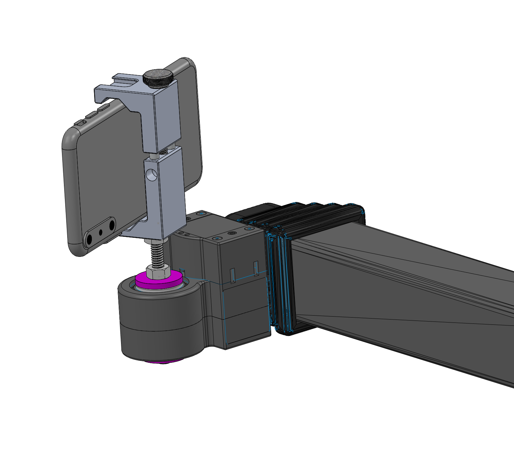

## Phone Holder

**Create by**: Hello Robot Inc

This tool allows you to attach a smart phone to your Stretch. It uses an off the shelf phone holder with and a photography standard 1/4-20 attachment post. 

## Parts List

| Item | Qty | Vendor           |
| ------------- |:-------------:| -----: |
| [1/4-20 x 3" BHCS](https://www.mcmaster.com/98164a246) | 1 | McMaster-Carr|
| [1/4-20 Nut](https://www.mcmaster.com/97149a100) | 2 | McMaster-Carr|
| [wrist_mount_spacer.STL](CAD/wrist_mount_spacer.STL) | 2 |    PLA 3D printer|
| [Ulanzi ST-01 Phone Tripod Mount](https://www.amazon.com/gp/product/B01LXB7SLO/ref=ppx_yo_dt_b_search_asin_title?ie=UTF8&psc=1)  | 1 | Amazon |

## Assembly instructions
[View 3D assembly](CAD/ASSEM_Phone_Holder.STL)

1. Install the two wrist_mount spacers onto wrist
2. Install the long bolt and lock into place using the first nut. Friction will hold this in a fixed orientation.
3. Install the second nut and then the phone mount, screwing onto the bolt
4. Lock the phone mount into place, using the second nut as a jam nut

If you want to adjust the phone orientation relative to the wrist yaw, loosen up the jam nut, adjust, then tighten.
