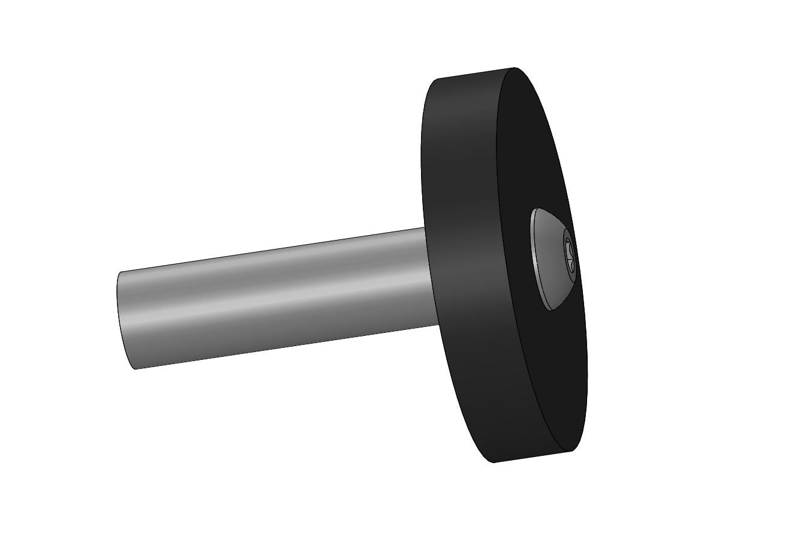
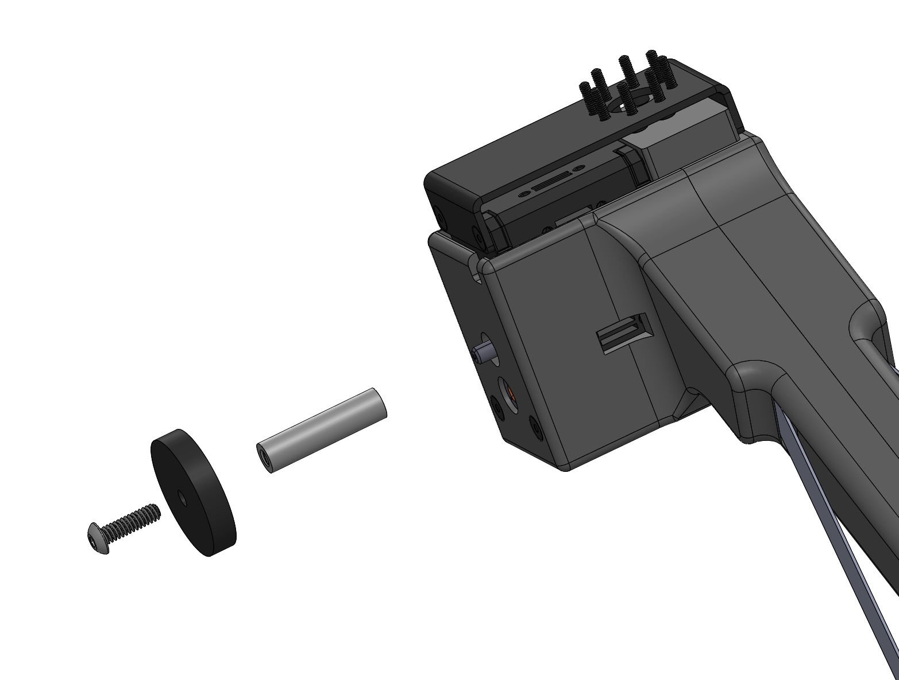

## Puller

**Create by**: Hello Robot Inc

This is a a simple 'puller' attachment for the Stretch Compliant Gripper. We've used it to pull open many common drawers, cabinet doors, and even a mini-fridge door. You can also use it to push things closed, such as drawers. You can think of it as a circular hook used to pull things or a finger used to push things.

It attaches to the 6-32 stud on the side of the gripper. By turning the gripper sideways during manipulation, the hook can drop over the drawer handle, allowing the arm to retract and pull the door open. 

## Parts List

| Item | Qty | Vendor           |
| ------------- |:-------------:| -----: |
| [6-32 x 0.5" BHCS](https://www.mcmaster.com/91255A148) | 1 | McMaster-Carr|
| [6-32 x 1" aluminum threaded standoff](https://www.mcmaster.com/93330a449) | 1 | McMaster-Carr|
| [Puller_V1.STL](CAD/Puller_V1.STL) | 1 |    PLA 3D printer|

## Assembly instructions
[View 3D assembly](CAD/ASSEM_Puller_V1.STL)

1. Screw the standoff on to the gripper's threaded post. Secure tightly and add a drop of light duty Loctite if desired.
2. Attach the plastic pull to the standoff using the BHCS. 
