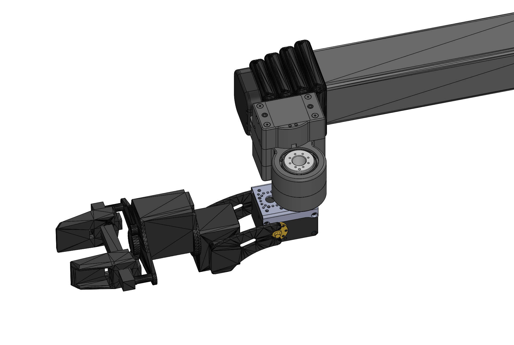
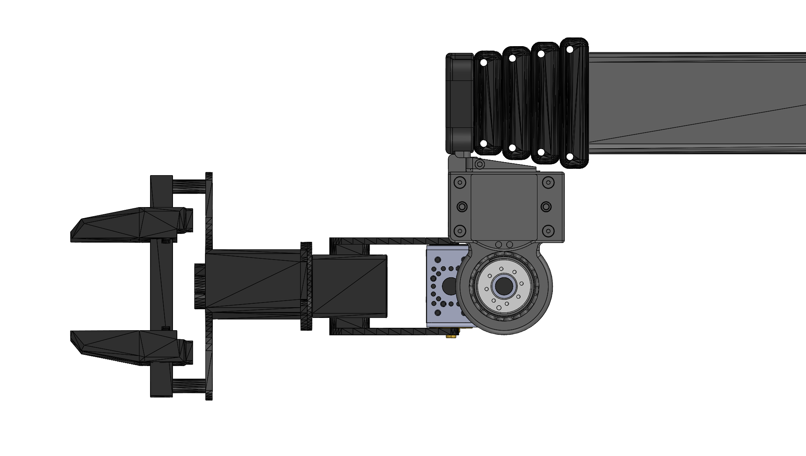
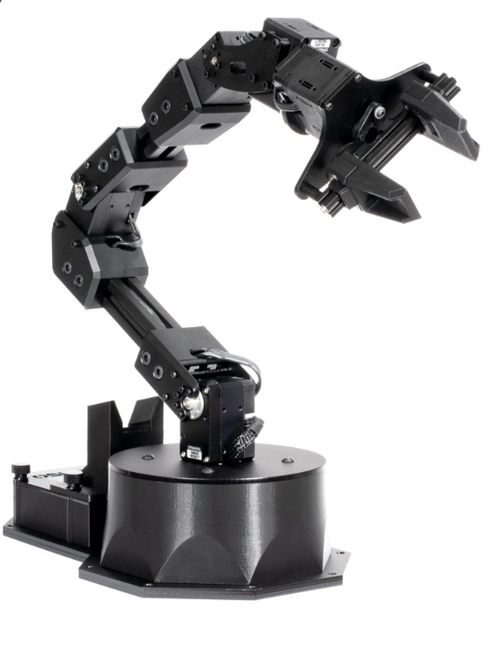
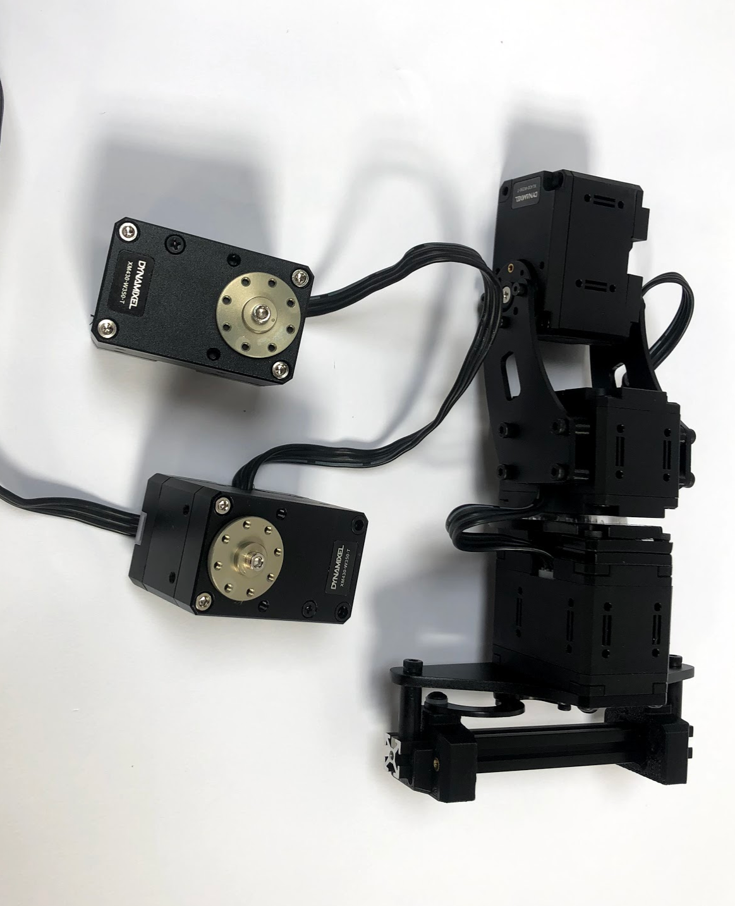
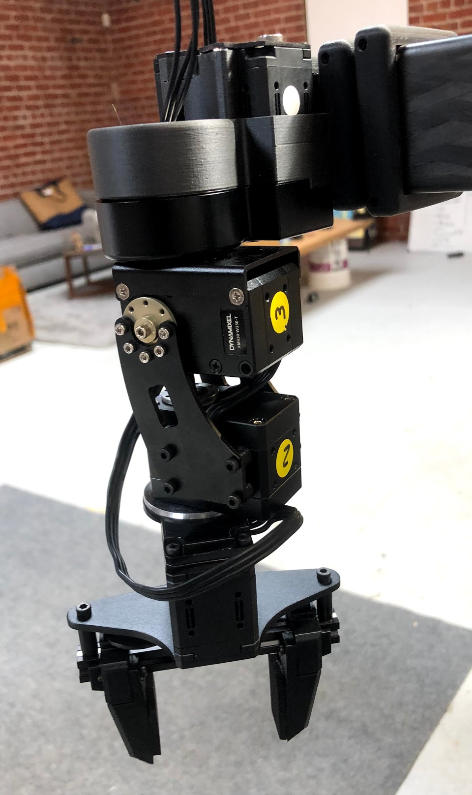
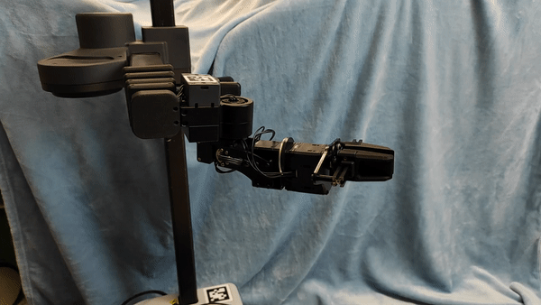
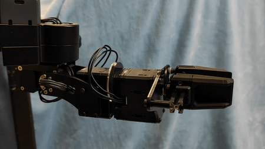
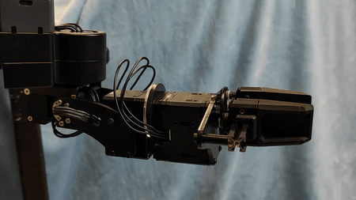
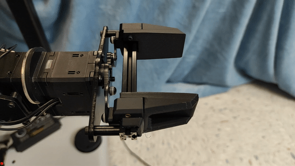
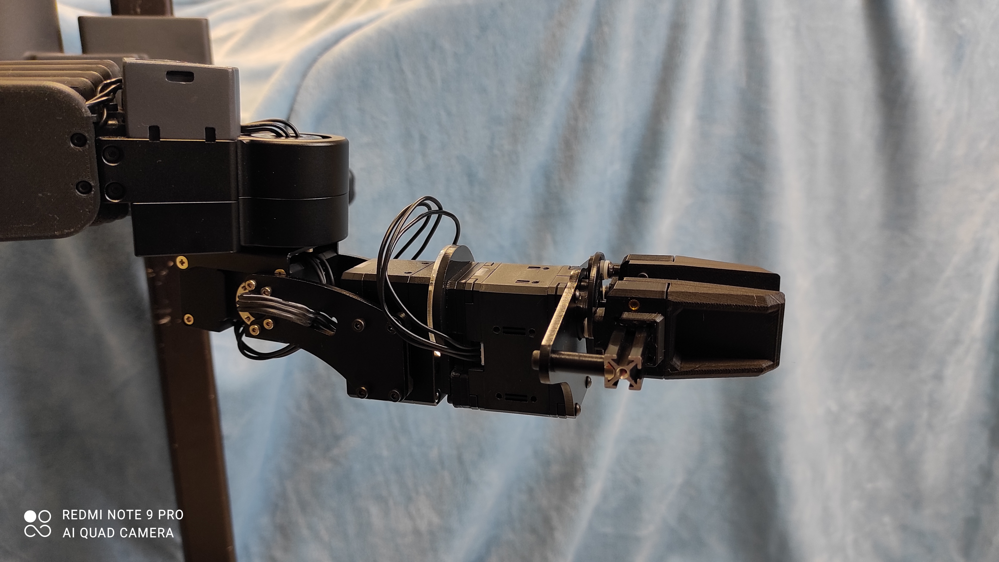

## Reactor X Wrist

**Created by**: Hello Robot Inc

Here we describe how to modify an [Interbotx ReactorX 150 Dynamixel arm](https://www.trossenrobotics.com/reactorx-150-robot-arm.aspx) to add a Pitch-Roll wrist plus parallel jaw gripper to Stretch, giving you a Yaw-Pitch-Roll wrist!

The ReactorX 150 comes standard with Dynamixel XM430-W350-T servos for the shoulder joints and XL430-W250-T servos for its wrist and gripper. We're going to disassemble the arm and then rebuild it so that the Pitch and Roll DOF use the stronger XM430-W350-T servos.

[View the 3D assembly](CAD/ReactorX_Wrist_V1.STL)





## Parts List

| Item | Qty | Vendor           |
| ------------- |:-------------:| -----: |
| [ReactorX 150 Robot Arm](https://www.trossenrobotics.com/reactorx-150-robot-arm.aspx) | 1 | Trossen Robotics |
| [Robotis FR12-S101K Frame](http://www.robotis.us/fr12-s101k-set/) | 1 | Robotis |
| [M2x4mm SHCS](https://www.mcmaster.com/90128a176) | 10 | McMaster Carr |

## Wrist Build



Start with a ReactorX 150


Detach the the wrist unit from the arm. This includes the final pitch / roll /gripper DOFs with the XL430 servos.




Remove the XM430 servos from the shoulder of the arm. The XM430s have the metal horns as shown.


No replace the pitch and roll servos with the XM430s. Pay attention to how the cables route and which ports they plug into so you can recable the wrist correctly. 


To attach the two side plates to the pitch servo (above, right), you'll want to use the shorter M2x4mm screws. The ones that came off of the XL430s are too long and will cause the servo to bind up if used. 


Recable the servos and attach the pitch and roll joints to the gripper. You're done!

## Other Modifications

The FR12-S101K frame doesn't allow a X-Series TTL connector to pass through by default. You will need to drill out one of the 8mm holes on a drill press to 10mm. This will allow the cable routing to go through the center of Wrist Yaw rotation (recommended)

## Dynamixel Configuration

The Dynamixel servos that come with the Reactor arm need to be reprogrammed with the correct IDs and baudrate. Out of the box, the Reactor servos use a baudrate of 1Mbps while Stretch requires 115200Kbps. To reconfigure the servos:

1. Download and install the Dynamixel Wizard 2.0 from Robotis
2. Attach your 3 DOF gripper-wrist to a PC using a U2D2 adapter from Robotis
3. Launch the Wizard and click Scan. It should identify the three servos.
4. Select each servo from the left hand drop down menu and set its baudrate and ID. Hit save.

By convention we use Dynamixel IDs of:

* Wrist PITCH: 14
* Wrist ROLL: 15
* Gripper: 16


## Assembly instructions




Now attach your wrist to the Stretch tool plate using the Robotis Frame and their provided hardware, as shown above.

## Code

You're ready to start using your wrist. Once it is plugged into the robot you will want to:

### Install Stretch Tool Share

```bash
>>$ pip install -U hello-robot-stretch-tool-share
```

#### Backup User YAML

```
$ cd $HELLO_FLEET_PATH/$HELLO_FLEET_ID
$ cp stretch_user_params.yaml stretch_user_params.yaml.bak
```

#### Update User YAML

```yaml
   robot:
     tool: tool_reactor_wrist
     params: ['stretch_tool_share.reactorx_wrist_v1.params']
   lift:
     i_feedforward: 0.75
   hello-motor-lift:
     gains:
       i_safety_feedforward: 0.75
```

#### Set the Baud Rate

The default YAML for the Reactor wrist is set to 115200. Your robot may be running at 57600. 

You can check the current baud settings by:

```bash
>>$ stretch_params.py | grep baud
stretch_body.robot_params.nominal_params   param.end_of_arm.baud                                                  115200                        
stretch_body.robot_params.nominal_params   param.head.baud                                                        115200                        
stretch_body.robot_params.nominal_params   param.head_pan.baud                                                    115200                        
stretch_body.robot_params.nominal_params   param.head_tilt.baud                                                   115200                        
stretch_body.robot_params.nominal_params   param.stretch_gripper.baud                                             115200                        
stretch_body.robot_params.nominal_params   param.tool_none.baud                                                   115200                        
stretch_body.robot_params.nominal_params   param.tool_stretch_gripper.baud                                        115200                        
stretch_body.robot_params.nominal_params   param.wrist_yaw.baud                                                   115200  
```


You can change the baud for a joint (eg ID 15)

```bash
>>$ REx_dynamixel_set_baud.py /dev/hello-dynamixel-wrist 15 115200
```

Ensure that all baud rates are at 115200 for the end-of-arm (IDs 13, 14, 15, 16)

#### Jog the Wrist

Try out the jog tool

```bash
>>$ reactor_wrist_jog.py
```

## Important Notes
With the release of the Stretch Dex Wrist, the Reactor Wrist build is not being actively supported by Hello Robot. Parameters describing the range of motion of the wrist pitch, roll, and gripper were most recently updated by [Kavya Puthuveetil](https://kpputhuveetil.github.io/) from [RCHI Lab @ CMU](https://rchi-lab.github.io/) for an independent research project using the Reactor Wrist in September 2022. As a result, these values may not match the convention used for other end of arm tools in Stretch Tool Share created by Hello Robot. We provide visualizations of the range of motion for each joint as defined in the [params file for the Reactor Wrist](https://github.com/kpputhuveetil/stretch_tool_share/blob/master/python/stretch_tool_share/reactorx_wrist_v1/params.py) for your reference.

### Wrist Pitch

Pitch Angle = 0 &rarr; Pitch Angle = π/2

### Wrist Roll

Roll Angle = 0 &rarr; Roll Angle = π


Roll Angle = 0 &rarr; Roll Angle = -π

### Gripper

Gripper Angle = π/2 &rarr; Gripper Angle = 0

### Example: All Joints Zeroed

Pitch, Roll, Gripper Angle = 0

To edit the range of motion or zero position for any of the gripper joints, you can modify the 'range_t' and 'zero_t' parameters defined in `python/stretch_tool_share/reactorx_wrist_v1/params.py`, respectively.
