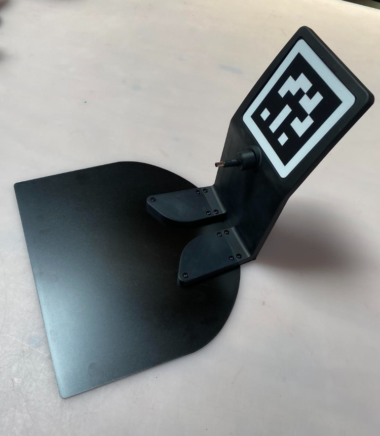

# Stretch Docking Station

**Created by**: Hello Robot Inc

## Overview



The Stretch Docking Station provides automated charging of Stretch. A 110mm Aruco tag on the docking station allows the robot to accomplish visually guided docking. 

## Hardware

Coming soon.

### Assembly

Coming soon.

## Software

Coming soon.

### ROS Support

#### URDF

The Stretch Docking Station,  can be included in Gazebo and RViz. The URDF data is [available on the Stretch Tool Share](https://github.com/hello-robot/stretch_tool_share/tree/master/tool_share/stretch_docking_station/stretch_docking_station_description).

```bash

x

```


### Gazebo

Coming soon.

