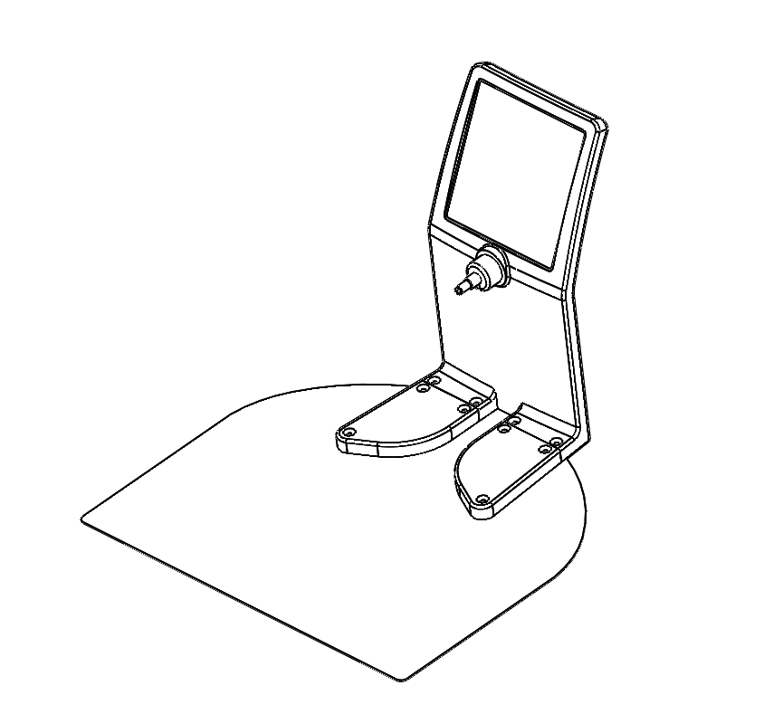
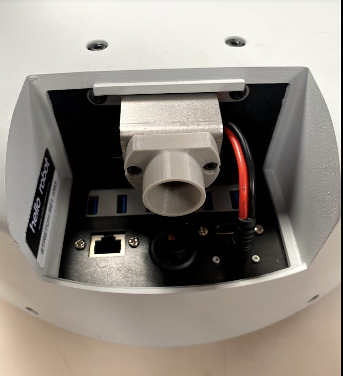
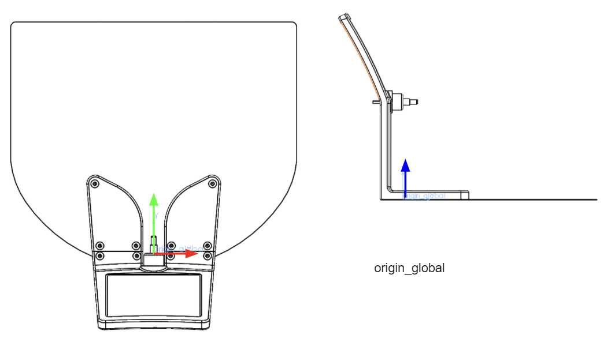
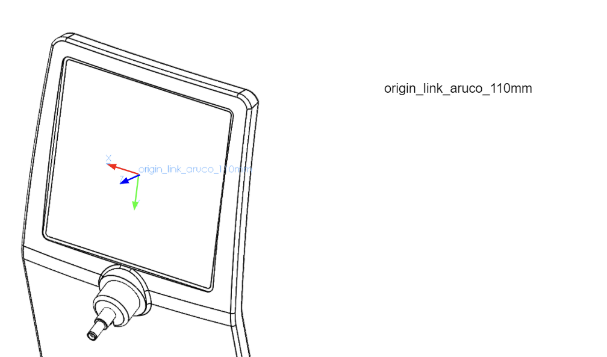

# Stretch Docking Station (Beta)



## Assembly

Attach the docking plug to Stretch using two M4x8mm screws (provided). Plug its cable into the Stretch charge port.



## Test

Plug the NOCO charger into the docking station and place in 12V SUPPLY mode. Next run the script [detect_plugin.py](https://github.com/hello-robot/stretch_tool_share/blob/features/docking_station/tool_share/stretch_docking_station_beta/python/detect_plugin.py)

Manually dock the robot to the station and verify that the robot beeps upon docking, as shown in [this video](https://youtu.be/6JZ1YHY2rDg).

## URDF

The URDF for the docking station, provided [here](https://github.com/hello-robot/stretch_tool_share/tree/features/docking_station/tool_share/stretch_docking_station_beta/stretch_docking_station_description), can be used to get the transform from the docking station world frame to the Aruco frame.  

The frames are positioned as shown:





To work with the URDF from ```urdfpy  ```, you can run the [example script](https://github.com/hello-robot/stretch_tool_share/blob/features/docking_station/tool_share/stretch_docking_station_beta/python/stretch_docking_station_visualizer.py): 

```bash
>>$ cd ~/repos/stretch_tool_share/tool_share/stretch_docking_station_beta
>>$ ./export_urdf.sh
>>$ ./python/stretch_docking_station_visualizer.py

For use with S T R E T C H (TM) RESEARCH EDITION from Hello Robot Inc.

Docking Station to Aruco transform
[[ 1.          0.          0.          0.        ]
 [ 0.          0.45395257  0.89102585 -0.050582  ]
 [ 0.         -0.89102585  0.45395257  0.20519   ]
 [ 0.          0.          0.          1.        ]]

```


