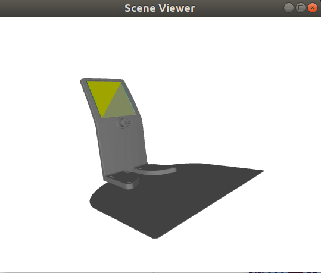

# Stretch Docking Station (Beta)

## Assembly

x

## URDF

The URDF for the docking station, provided [here], can be used to get the transform from the docking station world frame to the Aruco frame.  

To work with the URDF from ```urdfpy  ```, you can run the example script: 

```bash
>>$ cd ~/repos/stretch_tool_share/tool_share/stretch_docking_station_beta
>>$ ./export_urdf.sh
>>$ ./python/stretch_docking_station_visualizer.py

For use with S T R E T C H (TM) RESEARCH EDITION from Hello Robot Inc.

Docking Station to Aruco transform
[[ 1.          0.          0.          0.        ]
 [ 0.          0.45395257  0.89102585 -0.050582  ]
 [ 0.         -0.89102585  0.45395257  0.20519   ]
 [ 0.          0.          0.          1.        ]]

```




