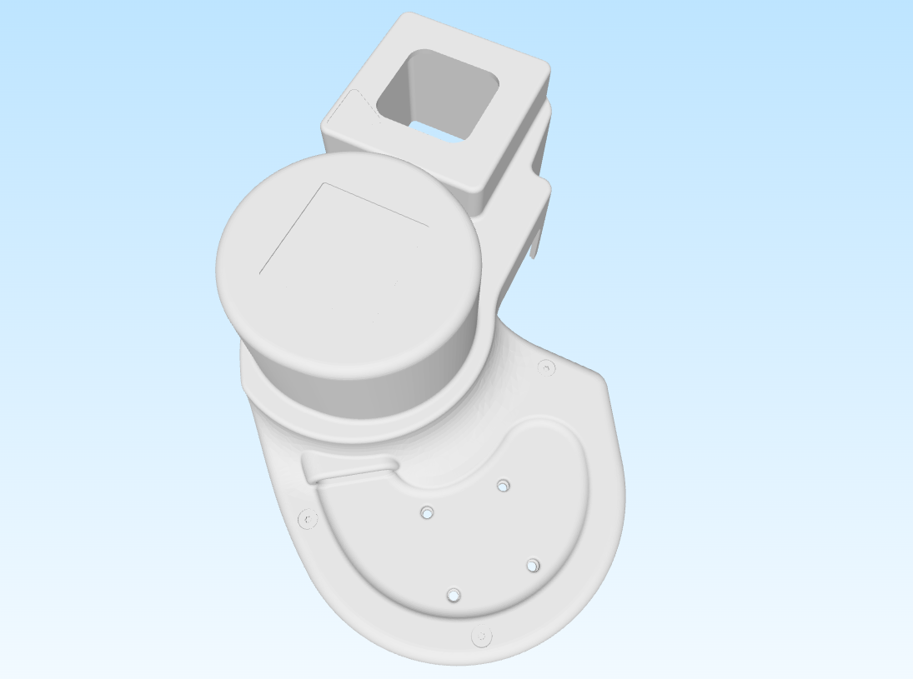

# Stretch Shoulder

This step file captures the robot's shoulder shell. It aims to make it easier to build designs in CAD that attach to the shoulder's mounting points. Schematics and more details available in the [Extending Stretch with Additional Hardware](https://docs.hello-robot.com/0.3/extending_stretch/extending_stretch_additional_hardware/).

