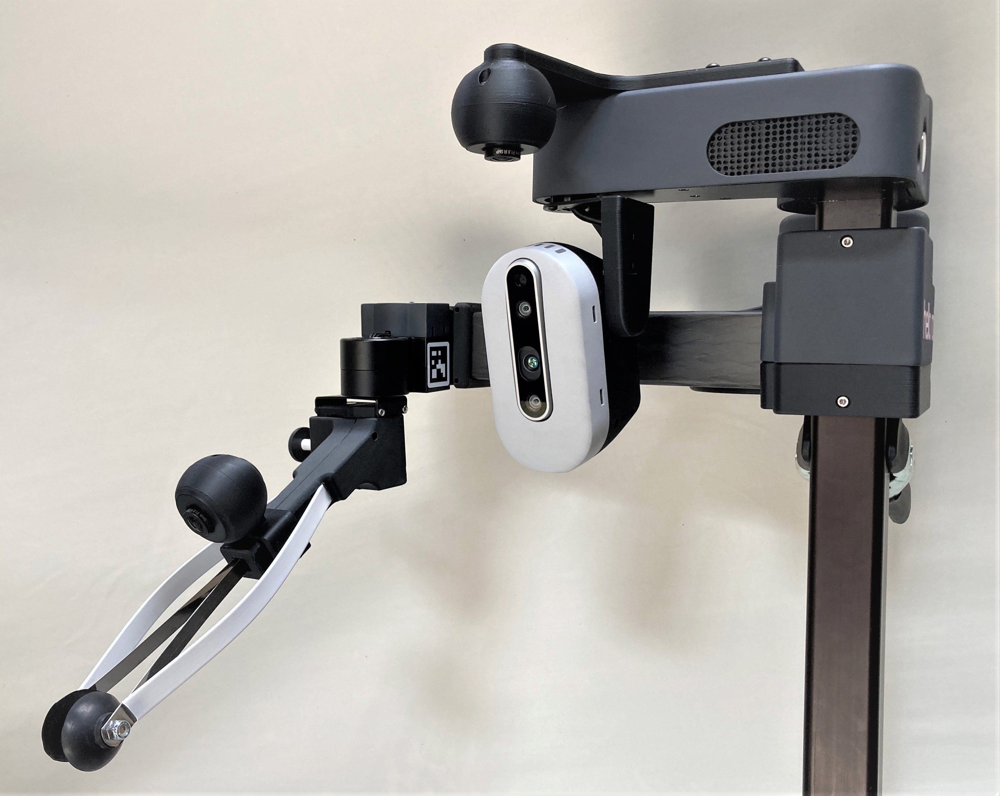
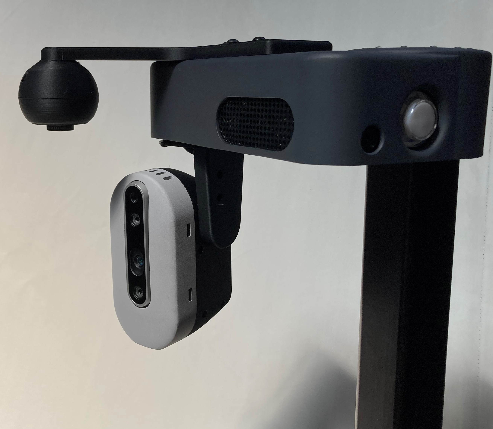
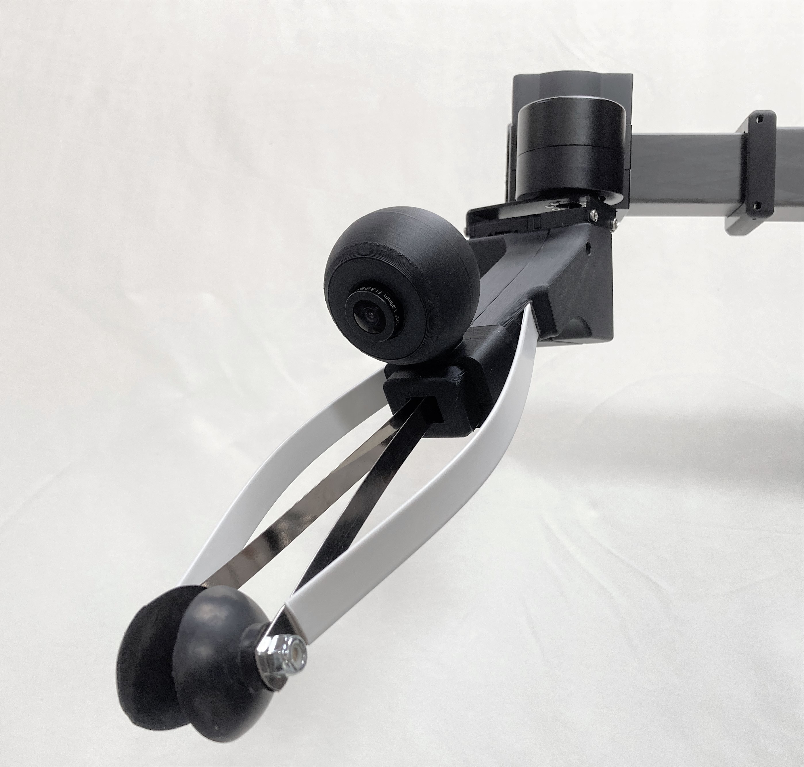
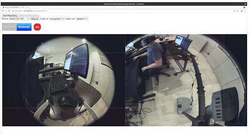
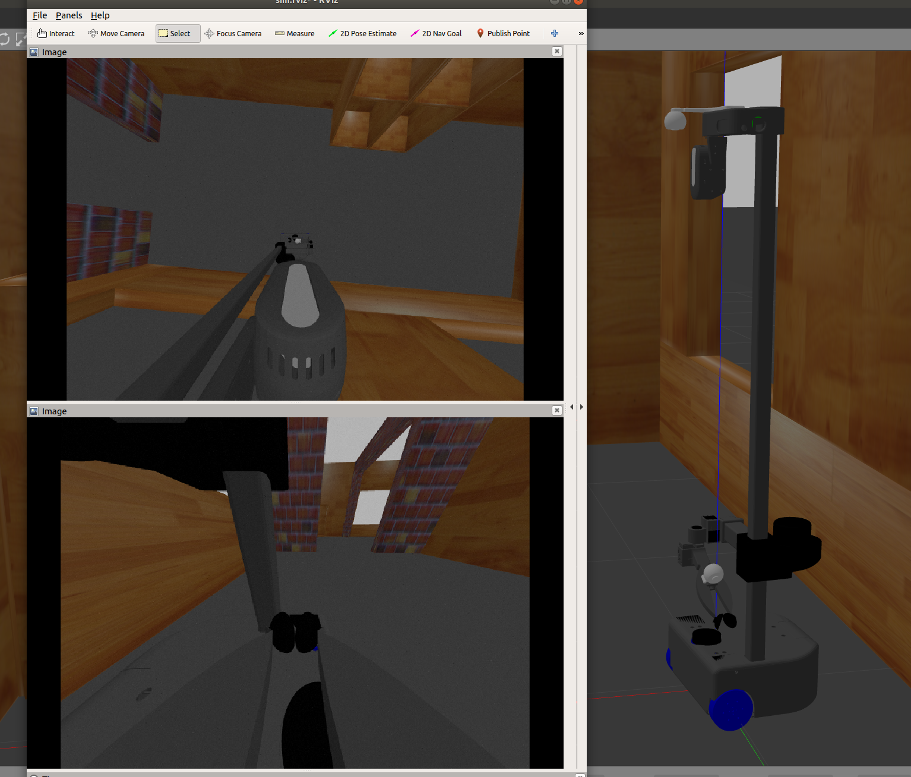

# Stretch Teleop Kit

**Created by**: Hello Robot Inc

## Overview








The Stretch Teleop Kit allows for improved remote teleoperation of Stretch. It adds two fish-eye USB cameras to Stretch. One is added to the robot's gripper for a better view while manipulating. The other is added to the robot's head and points downward, providing a better view while navigating. 

## Hardware

The Stretch Teleop Kit uses [two Spinel UC20MPE_F185 USB cameras](https://store.spinelelectronics.com/UC20MPE_F185) that provide a 185 degree FOV and 2MP resolution. These board cameras are mounted in 3D printed shells and attached to existing mount points of the Stretch. 

### Assembly

Hello Robot has [provided the STL files, BOM, and assembly instructions necessary](images/Stretch_RE1_Teleop_Kit_Build.pdf) to build your own Stretch Teleop Kit. Alternatively, the kit is [available for sale by Hello Robot](https://hello-robot.com/). 

**Note if building your own kit:*: The Spinel cameras come with a custom USB to JST ZH cable. We recommend using a custom length cable however in order to improve the cable routing of your system. Please contact Hello Robot for details. 

| 3D Printed Parts                                             |
| ------------------------------------------------------------ |
| [3DP-808_Teleop_Camera_Mount_Front.STL](CAD/3DP-808_Teleop_Camera_Mount_Front.STL) |
| [3DP-809_Head_Teleop_Mount_Back.STL](CAD/3DP-809_Head_Teleop_Mount_Back.STL) |
| [3DP-810_Head_Teleop_Mount.STL](CAD/3DP-810_Head_Teleop_Mount.STL) |
| [3DP-811_Gripper_Teleop_Mount_Back.STL](CAD/3DP-811_Gripper_Teleop_Mount_Back.STL) |
| [3DP-812_Gripper_Teleop_Mount_Bottom.STL](CAD/3DP-812_Gripper_Teleop_Mount_Bottom.STL) |

## Software

### Teleoperation Interface

The Stretch Teleop Kit includes the [open-source teleoperation interface (beta)](https://github.com/hello-robot/stretch_fisheye_web_interface) that utilizes these cameras as shown below. 



### ROS Support

#### URDF

The Stretch RE1 URDF can be augmented with these two cameras as well. The URDF information [is found here](./stretch_description).

To add the Teleop Kit to your URDF:

```bash
cd ~/catkin_ws/src/stretch_ros/
git pull

cd ~/repos
git clone https://github.com/hello-robot/stretch_tool_share

cd ~/repos/stretch_tool_share/tool_share/stretch_teleop_kit/stretch_description
cp urdf/stretch_teleop_kit.xacro ~/catkin_ws/src/stretch_ros/stretch_description/urdf
cp urdf/stretch_description.xacro ~/catkin_ws/src/stretch_ros/stretch_description/urdf
cp meshes/*teleop*.STL ~/catkin_ws/src/stretch_ros/stretch_description/meshes
```


### Gazebo
The Stretch RE1 robot with the Teleop Kit can also be simulated with [Gazebo](https://gazebosim.org/) simulator. The information on Stretch robot's Gazebo implementation can be found here [stretch_gazebo](https://github.com/hello-robot/stretch_ros/tree/master/stretch_gazebo).

To add Teleop kit to the Stretch Gazebo implementation:

```bash
cd ~/catkin_ws/src/stretch_ros/
git pull

cd ~/repos
git clone https://github.com/hello-robot/stretch_tool_share

cd ~/repos/stretch_tool_share/tool_share/stretch_teleop_kit/stretch_description
cp urdf/stretch_teleop_kit.xacro ~/catkin_ws/src/stretch_ros/stretch_description/urdf
cp urdf/stretch_gazebo.urdf.xacro ~/catkin_ws/src/stretch_ros/stretch_gazebo/urdf/stretch_gazebo.urdf.xacro
cp meshes/*teleop*.STL ~/catkin_ws/src/stretch_ros/stretch_description/meshes
```

During Gazebo simulation the two Teleop camera's video streams would be published to the topics "teleop/gripper_camera" and "teleop/head_camera".




