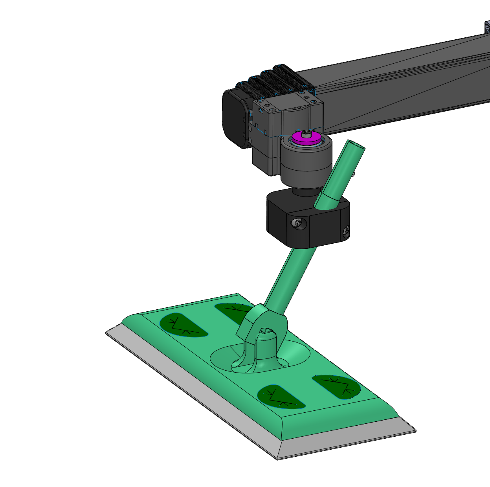

## Swiffer Mount

**Created by**: Hello Robot Inc

This tool allows a Swiffer duster to your Stretch. The designs uses a clamp to hold the Swiffer handle in place, allowing the height and orientation of the Swiffer to be adjusted by loosening the clamp.

## Parts List

| Item                                                                                                                                         | Qty | Vendor           |
|----------------------------------------------------------------------------------------------------------------------------------------------|:-------------:| -----: |
| [M5x50mm BHCS](https://www.mcmaster.com/92095A228)                                                                                           | 3 | McMaster-Carr|
| [M5 nut](https://www.mcmaster.com/93330a449)                                                                                                 | 4 | McMaster-Carr|
| [swiffer_mount.STL](CAD/swiffer_mount.STL)                                                                                                   | 1 |    PLA 3D printer|
| [swiffer_mount_clamp.STL](CAD/swiffer_mount_clamp.STL)                                                                                       | 1 | PLA 3D printer |
| [wrist_end_cap_5mm.STL](CAD/wrist_end_cap_5mm.STL)                                                                                           | 1 | PLA 3D printer |
| [Swiffer Sweeper Cleaner Dry and Wet Mop Kit](https://www.amazon.com/gp/product/B00N6FT6TM/ref=ppx_yo_dt_b_asin_title_o08_s00?ie=UTF8&psc=1) | 1 | Amazon |

## Assembly instructions
[View 3D Assembly](CAD/ASSEM_Swiffer_Holder_V1.STL)

1. Attach the M5 bolt through the swiffer_mount_primary part and lock into place by tightening the M5 nut
2. Attach  swiffer_mount_primary to the tool plate using the wrist_end_cap_5mm and a second M5 nut. Friction holds the assembly in place against the tool plate.
3. Attach the swiffer_mount_clamp part using two M5 bolts and nuts, clamping the shaft of the Swiffer handle in place. Adjust the length and orientation of the Swiffer and clamp in place.
4. Clean away!
