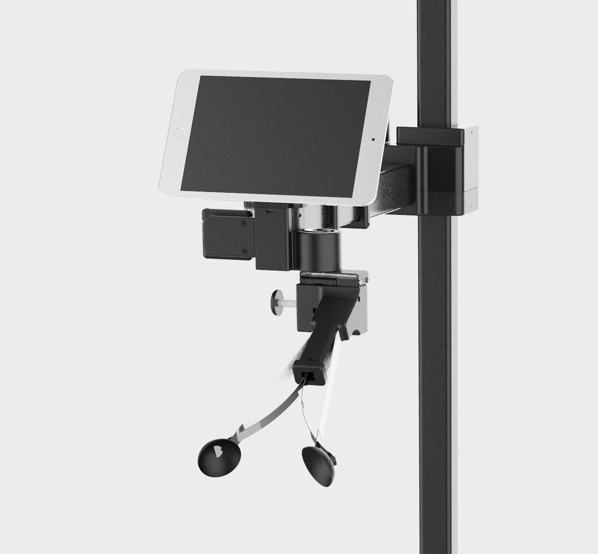
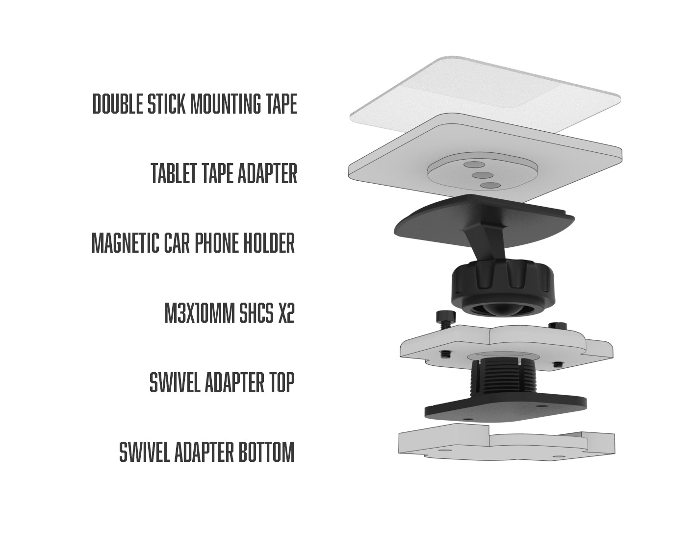
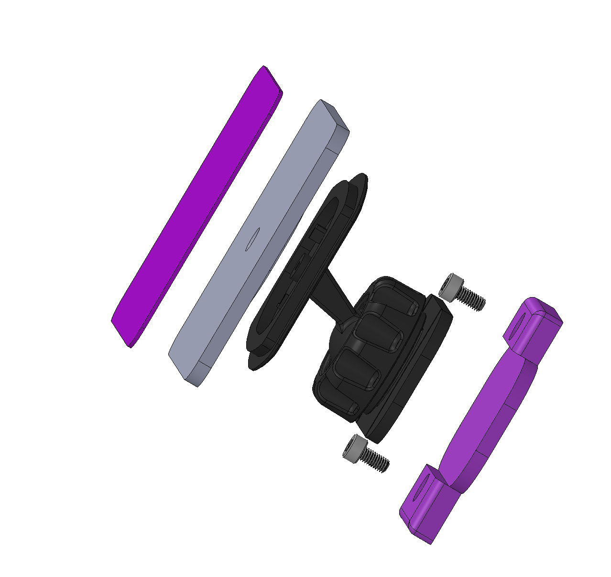
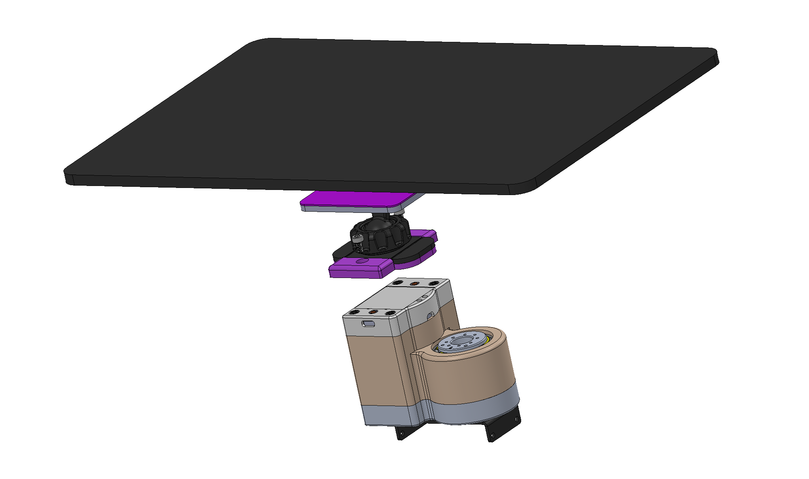

## Swivel Tablet Mount

**Created by**: Hello Robot Inc

This tool allows a tablet to be attached to the Stretch wrist. The design uses an off-the-shelf swivel phone holder, two 3D printed adapter plates, and a die-cut double stick tape..

## Parts List

| Item                                                                                                                                         | Qty | Vendor           |
|----------------------------------------------------------------------------------------------------------------------------------------------|:-------------:| -----: |
| [M3x10mm SHCS](https://www.mcmaster.com/91290A115/)                                                     | 2 | McMaster-Carr|
| [Double stick mounting tape 2 3/8"](https://www.amazon.com/gp/product/B09VRXDMWW/ref=ppx_yo_dt_b_search_asin_title?ie=UTF8&psc=1) | 1 | Amazon |
| [swivel_adapter_top.STL](CAD/swivel_adapter_top.STL)                                                    | 1 | PLA 3D printer |
| [swivel_adapter_bottom.STL](CAD/swivel_adapter_bottom.STL)                                              | 1 | PLA 3D printer |                          
| [tablet_tape_adapter.STL](CAD/tablet_tape_adapter.STL)                                                  | 1 | PLA 3D printer |
| [Magnetic car phone holder](https://www.amazon.com/gp/product/B075XZBKBQ/ref=ppx_yo_dt_b_search_asin_title?ie=UTF8&th=1) | 1 | Amazon |

## Assembly instructions
[View 3D Assembly](CAD/ASSEM_ball_swivel.STEP)

1. Remove the rubber cover from the phone holder. You'll see metal plate holding the magnets. Remove the metal plate with a screw driver.
2. Attach the 'tablet_tape_adapter' to the phone holder, reusing the screw you just remove. Note: If the adapter does not sit flat you may want to clip the plastic 'L' tabs from the holder using side cutters.
3. Unscrew the large nut on the phone holder and disengage the ball from its socket.
4. Remove the red sticker from the phone holder, exposing the double stick tape. Stick the phone holder firmly onto the 'swivel adapter'
5. Attach the swivel adapter to the top of the Stretch wrist using the M3 bolts
6. Attach the tablet_tape_adapter to your tablet in the desired position using the 'double stick mounting tape'
7. Finally, insert the ball back into the socket of the phone holder. Attach firmly using the large nut.
