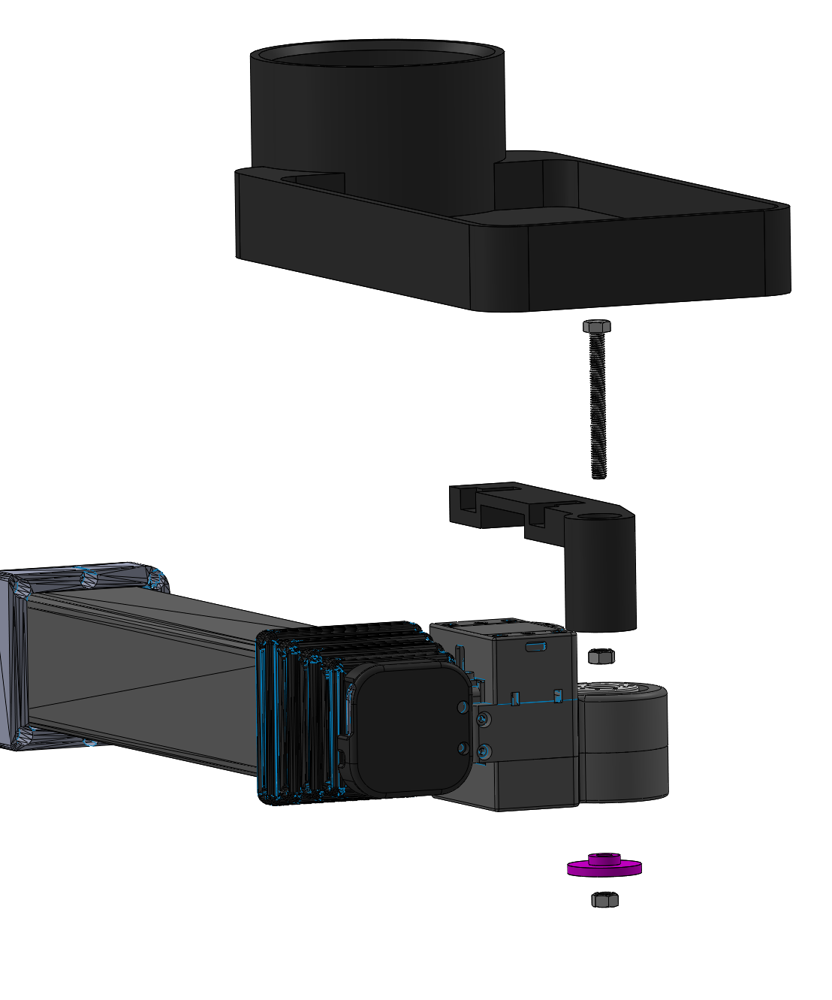

## Tray Cup Holder

**Created by**: Hello Robot Inc

This is a tray and cup holder attachment for your Stretch.  The tray stows nicely within the robot footprint during navigation and can un-stow upon delivery to a person.

The 3D printed attachment clips easily onto the bottom of an off the shelf tray. 

## Parts List

| Item | Qty | Vendor           |
| ------------- |:-------------:| -----: |
| [M5 Nut](https://www.mcmaster.com/90591A260) |  2   | McMaster-Carr|
| [M5x50mm Hex Head Bolt](https://www.mcmaster.com/91287A333) | 1 | McMaster-Carr|
| [wrist_end_cap_5mm.STL](CAD/wrist_end_cap_5mm.STL) | 1 |    PLA 3D printer|
| [tray_clip.STL](CAD/tray_clip.STL) | 1 | PLA 3D printer |
| [AUTUT Universal Car Cup Holder](https://www.amazon.com/gp/product/B07WTYTBT5/ref=ppx_yo_dt_b_asin_title_o03_s01?ie=UTF8&psc=1) | 1 | Amazon |

## Assembly instructions
[View 3D assembly](CAD/ASSEM_tray_cupholder_V1.STL)

1. Install the M5 bolt into the tray clip and secure it rigidly to the part using the M5 nut.
2. Clip the tray onto the tray clip.
3. Drop the tray clip assembly on to the tool plate from above. Secure it to the tool plate using the wrist_end_cap_5mm and M5 nut. 
