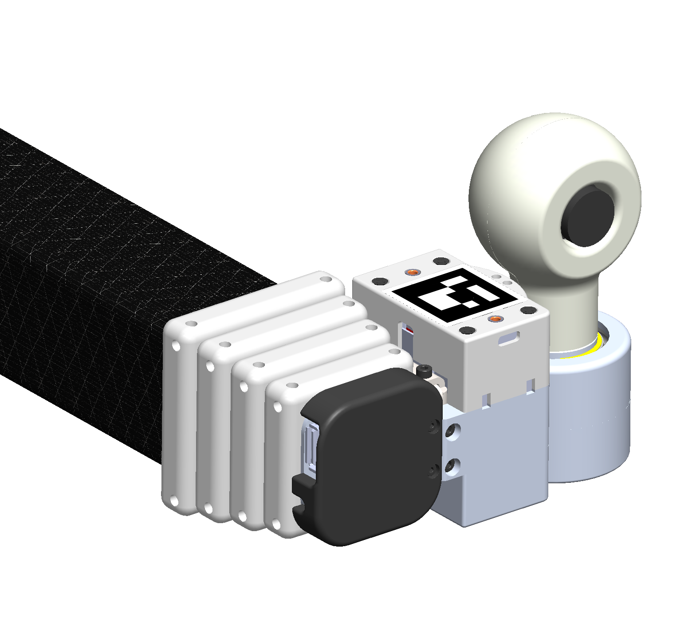
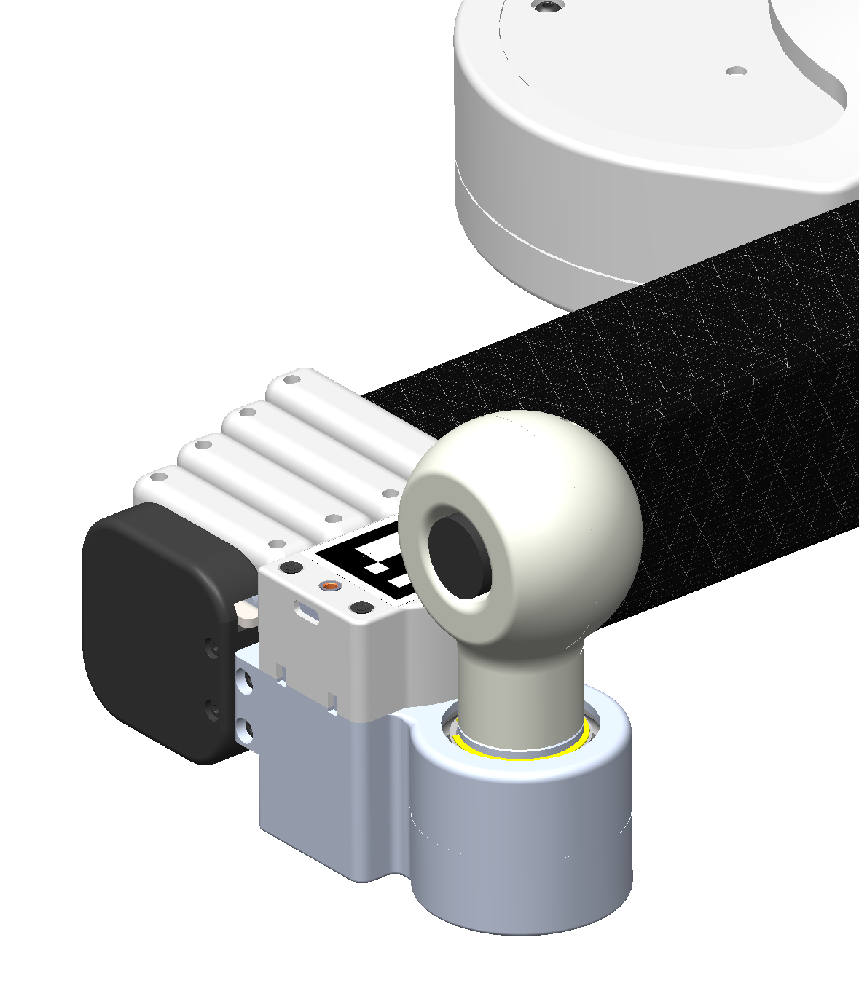

## Wrist USB Board Camera

**Create by**: Hello Robot Inc

This design allows you to attach a USB board camera to the wrist yaw joint of Stretch. The wrist mounted camera can pan left-right, making it perfect for simple remote inspection tasks.

The camera can be integrated into your robot URDF by integrating its [stretch_description](./stretch_description) as described in the [Stretch ROS documentation](https://github.com/hello-robot/stretch_ros/tree/master/stretch_description).

## Parts List

| Item | Qty | Vendor           |
| ------------- |:-------------:| -----: |
| [M2x8mm SHCS](https://www.mcmaster.com/91290A015) | 8 | McMaster-Carr|
| [M2x6mm Thread Forming Screw](https://www.mcmaster.com/96817A209) | 5 | McMaster-Carr|
| [Board_Camera_Ball_Shell.STL](CAD/Board_Camera_Ball_Shell.STL) | 1 |    PLA 3D printer|
| [Board_Camera_Ball_Cover.STL](CAD/Board_Camera_Ball_Cover.STL) | 1 | PLA 3D printer |
| [ELP 2MP USB Board Camera](https://www.amazon.com/ELP-Camera-Megapixel-Windows-Android/dp/B00KA7WSSU/ref=sr_1_3?dchild=1&keywords=elp+camera+cable&qid=1613066230&s=electronics&sr=1-3) (Suggested) | 1 | Amazon / Spinel |

## Assembly instructions
[View 3D assembly](CAD/wrist_USB_board_camera_assembly.STL)

1. Attach the Board_Camera_Ball_Shell to the wrist tool plate using the 8 M2 bolts
2. Attach the camera to the Board_Camera_Ball_Shell using 4 self-threading screws
3. Attach the USB cable and route it down and through the wrist yaw passage
4. Attach the Boad_Camera_Ball_Cover using 1 self-threading screw
5. Plug the USB cable into the USB-A port on the wrist

NOTE: The USB cable that comes with the camera uses a JST-PH connector. You may want to make your own cable with a custom length using a right-angle USB-A cable. This may require a JST-PH crimp tool.

NOTE: A variety of USB board cameras are available from ELP and Spinel, among others. The shells may need to be modified to accommodate variations in the mechanical packaging of these cameras.
